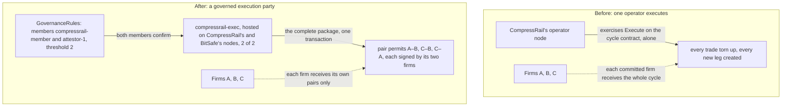

# CompressRail

Confidential multilateral portfolio compression for OTC derivatives, built on the Canton Network.

CompressRail lets a group of derivatives counterparties tear up offsetting bilateral trades and
atomically redistribute counterparty exposure. Economic terms are encrypted on the ledger, and the operator
party is not a decryption recipient; see [what is exposed](#what-operator-blind-means-here--precisely) for
the limits.

> **HackCanton Season 3 / BitSafe Gold: governed execution on DevNet.** A compression cycle executed on
> 6 October 2026 through a Decentralized Party that CompressRail and BitSafe operate together: rejected with
> one approval, executed with both. [What ran and what it does not show](#governed-execution-on-devnet-with-bitsafe)
> · [recorded results](daml-governed/devnet/results-2026-10-06.json)
> · [the same flow on LocalNet in one command](daml-governed/README.md#reproduce-on-a-clean-machine)

**Hosted demo:** [demo.compressrail.com](https://demo.compressrail.com) (single participant, operator-executed cycle) · **Documentation:** [docs.compressrail.com](https://docs.compressrail.com) · **Hosted-demo video:** [youtu.be/8XmG6ss5XuY](https://youtu.be/8XmG6ss5XuY)

> **Status:** early-stage MVP, first built for the Encode "Build on Canton" hackathon (June–July 2026); the
> governed DevNet execution was added for HackCanton Season 3 (October 2026). The demo,
> landing, and docs sites are live, and the demo runs **against our own Canton DevNet validator** —
> real transactions through the DevNet global synchronizer, including the atomic compression cycle,
> selective disclosure, and the operator-blindness check the privacy matrix and "try to cheat" control
> drive (see [Verify the live deployment](#verify-the-live-deployment)). A local Canton sandbox is used
> only for development and tests. A multilateral compression cycle has also run across three
> participant nodes, with the operator on a node of its own
> ([details and limits](#across-participant-nodes)), and through a Decentralized Party that CompressRail
> and BitSafe control together ([governed execution on DevNet](#governed-execution-on-devnet-with-bitsafe)). See
> [Roadmap](#roadmap) for what is not yet built. Not audited. Not for production use.

## Verify the live deployment

The hosted demo runs against our own Canton DevNet validator (not a local sandbox). You can confirm it
from outside:

```
curl https://demo.compressrail.com/ledger/v2/version
```

That is the live participant's JSON Ledger API. Every action in the demo — the compression cycle, the
operator-blindness check, the "try to cheat" control — submits real transactions through the DevNet
global synchronizer. The end-to-end suite passes against this same public endpoint (note: it allocates
parties on the validator):

```
cd app && E2E_LEDGER_URL=https://demo.compressrail.com/ledger npm run e2e
```

### Across participant nodes

The cycle has also run across three participant nodes: our DevNet validator (Firms A and C), the
NODERS-hosted HackCanton DevNet participant (Firm B), and a second validator of ours that hosts **only
the operator** ([`app/scenario/threenode.ts`](app/scenario/threenode.ts)).

Three trades form a ring no pair can net on its own — A–B 100, B–C 60, C–A 60 of one risk factor. Every
trade is agreed by propose/accept, because a submission can only act for parties hosted on the node it
is sent to. Each firm reads the proposed cycle from its own node, checks the plan against its own
decrypted trades, and commits there. The operator's execute, submitted from its own node, tears up all
three trades and creates one net leg of 40 between A and B, whose two signatories sit on different
nodes; C nets out entirely. The operator is a stakeholder of none of the trades and never holds one as
an active contract; their terms reach it only as ciphertext. It does receive the torn-up trades and the
new leg as transaction metadata when it executes, as does every firm in the cycle — see
[what is exposed](#what-operator-blind-means-here--precisely). An earlier two-node run ([`app/scenario/crossnode.ts`](app/scenario/crossnode.ts)) covers
the bilateral case.

What it does not show: the HackCanton node runs in colocation mode (tenants share one participant,
separated by namespace), and our two validators run on the same host, so this is not each firm running
its own institution's infrastructure. Both sides' keys live in one test process, so the off-ledger
handoff of the sealed leg is simulated. The hosted demo itself still runs on a single participant.

```
cd app && npm run e2e:threenode   # needs all three nodes configured; see scenario/threenode.e2e.test.ts
```

### Governed execution on DevNet, with BitSafe

The risk addressed: the right to execute a compression cycle sits with one operator. In the hosted demo, once
the firms commit, that operator alone executes the cycle, and every committed firm receives the whole cycle.
Here the execution right moves to a Decentralized Party that two independently operated organisations control
together; through the governed action, `CycleExecutionProposal`, it can execute only the complete approved
package, and each firm signs
only the permits for its own pairs.

On 6 October 2026, a compression cycle executed on Canton DevNet through `compressrail-exec`, a
Decentralized Party hosted on CompressRail's operator participant and BitSafe's `iBTC-validator-1`. Topology
read-backs from our host before and after execution showed 2-of-2 hosting confirmation, party-signing and
namespace thresholds, with no pending proposals in those checks. Decentralization Manager's deployed
`GovernanceRules` had one member from each organisation, a threshold of 2 and a 24-hour confirmation
validity period.

The pair permits designate `compressrail-exec` as their execution controller. With only our member's
confirmation, execution through `GovernanceRules` was rejected and the original trades and permits remained
active. After BitSafe's member `attestor-1` confirmed from its node, our member executed the complete
three-permit package in one transaction. `GovernanceExecutionResult` records both confirmers; A and B then held
the net A–B leg, while C held no remaining trades from the run.

For this run, the inspected party-filtered ledger-effects streams contained each firm's own pairs and no
governance contracts. The execution-party stream, queried on our operator host, contained all three pairs and
the governance contracts. BitSafe's manager on `iBTC-validator-1` shows the execution in its audit trail: the
three permit exercises, the three trade archives, the net-leg create and the execution result, with displayed
contract-id fragments matching ours (a screenshot shared by BitSafe on 7 October; the UI abbreviates ids and does
not show the update id).

Limitations: 2-of-2 hosting requires both hosts for execution; this run does not demonstrate outage tolerance.
Stock `GovernanceRules` can execute any compatible governed action that meets their checks; restricting
approvals to our cycle action is an operator policy, not an exact-template allowlist in the deployed rules. Our
manager's confirmation endpoint returned `INVALID_TOKEN` (missing a user ID), so our side confirmed and executed
the same rules choices directly through the Ledger API with an explicit `userId`. Our operator Ledger API has
authentication disabled and is restricted to private access. The test firms share infrastructure (A and C are
on our hosted-demo validator, whose JSON Ledger API is public), their bundle salts are generated in one test
process, and trade terms are placeholders. The cycle is scripted; this run does not exercise the matcher or
demonstrate confidentiality of real terms.

Recorded results and reproduction steps:
[`daml-governed/README.md`](daml-governed/README.md#devnet-run-devnet).

#### Before and after



#### Nodes, operators and plan beyond the hackathon

| Node | Operator | Hosts | Independent of CompressRail? |
|---|---|---|---|
| `compressrail-operator-1` | CompressRail | `compressrail-exec` (confirmation), member `compressrail-member` | — |
| `iBTC-validator-1` | BitSafe | `compressrail-exec` (confirmation), member `attestor-1` | yes: separate organisation, node, Decentralization Manager and keys |
| our DevNet validator (also the hosted demo) | CompressRail | test firms A and C | no; it shares a host with `compressrail-operator-1` |
| HackCanton participant | NODERS | test firm B | separate operator, but a shared participant with other tenants |

Technical owner: Levent Ceyhan (CompressRail, [@LevCey](https://github.com/LevCey)).

`compressrail-exec` stays on DevNet after the hackathon. It needs both hosts, so continuing to operate it depends
on BitSafe keeping its host and member, which we will agree with BitSafe. Remaining work, in order:

1. An authenticated deployment: OIDC for our Decentralization Manager and JWT authentication on our operator
   participant, rehearsed on a separate setup first, then switched over with BitSafe when no proposal or
   confirmation is open. Our side can then use the manager's own confirm and execute.
2. Rules that admit only the cycle action, so the restriction is enforced on the ledger rather than by policy
   (prototype: [`daml-governed/rules`](daml-governed/README.md#restricting-which-actions-the-party-can-execute-prototype)),
   prepared for discussion upstream with Decentralization Manager.
3. Each test firm on a node of its own, with its keys in its own process.
4. Private matching, then MainNet with a MainNet validator and an independent second member.

## The problem

Multilateral portfolio compression reduces the gross notional and the trapped initial margin sitting in
offsetting OTC derivatives trades. It addresses a large, real cost: industry estimates put regulatory
initial margin across non-cleared and cleared derivatives in the hundreds of billions of dollars, and
the funding cost of carrying that margin runs into the billions per year.

The mechanism that delivers compression carries a structural cost of its own. To find the offsetting
cycle, every participant has to submit its trade population, valuations, risk values and tolerances to a
central operator that computes the result — so that operator holds every participant's book. That is a
documented property of how the services work, not an inference.

Whether it is also what keeps firms away is a separate question, and one we do not claim to have
answered. Public sources do not attribute low participation to it, and buy-side and regional-bank
participation in existing services is documented. What CompressRail removes is the requirement itself:
you can join a cycle without disclosing positions to the operator coordinating it. Whether removing it
changes who participates is the hypothesis we are testing, not a result we are reporting.

## What CompressRail does

CompressRail moves the trust boundary from the operator to the protocol. The operator coordinates a
compression cycle but is architecturally unable to read any participant's economic terms. Each
participant verifies, on its own node, that its post-cycle risk stays within its declared tolerance, and
authorizes only its own legs. The whole multilateral rebalance commits atomically — every leg or none.
A participant can grant its home regulator a read-only view scoped to that participant's contracts alone.

## What "operator-blind" means here — precisely

Privacy claims in this space are easy to overstate, so here is the exact boundary.

The operator never sees any participant's economic terms — positions, sensitivities, notionals, or trade
details. Two mechanisms enforce this together:

1. **Daml stakeholder scoping.** The operator is never a signatory or observer on any contract that
   carries a participant's trade, so it is not notified when those trades are created and never holds
   one as an active contract. When it executes a cycle it does receive the trades being torn up and the
   new legs, as ciphertext (below).
2. **Application-layer encryption.** Every economic field is written on-ledger only as
   authenticated-encryption ciphertext plus a hash commitment, and the operator holds no decryption key.
   This second layer is necessary, not redundant: on Canton, the participant that submits a transaction
   interprets all of it, so anything stored in cleartext would be visible to whoever submits.

**What is exposed.** Economic payloads are encrypted, and the operator party is not a decryption
recipient. The operator and invited cycle participants receive transaction metadata, including
counterparty identities and ciphertext: from the moment a cycle is proposed, which pairs are to receive
replacement trades; once it executes, every trade torn up and every new leg, with their references and
commitments, plus each participant's yes/no "within tolerance" attestation. This does not guarantee
topology privacy or prevent inferences from participants' own trades and cycle outcomes — in a small
ring, a firm that knows its own trades and sees that another firm receives no new leg can work out that
firm's other trade. In this build the matching runs with all inputs in one place. Private matching and
reduced execution visibility are separate roadmap items. The current multi-node test uses a shared test
process holding participant keys.

**What this is not.** CompressRail is not zero-knowledge, not fully
homomorphic encryption, and not MPC. It does not make replacement trades legally enforceable — that is a
question of the parties' agreements, not of the protocol. It never takes custody of any asset; it
produces compression instructions and records.

Two invariants worth stating plainly. **Authenticity comes from the ledger, not the ciphertext:** the
sealed payload is anonymous, so a leg's terms are trustworthy only together with the Daml signatories on
the contract carrying its commitment — never standalone. **Teardown consent is by convention in this
build:** the trades a cycle will tear up are visible to each participant before it commits, but the
commit does not yet force a participant to re-assert consent to that exact list on-ledger; binding it
(via the modeled `NominateIntoCycle` marker) is roadmap.

## Why Canton

The problem needs three properties at the same time, which Canton provides natively:

- **Sub-transaction privacy** — a party sees only the contracts it is a stakeholder of.
- **Atomic multi-party composition** — one transaction can archive many bilateral trades and create
  their replacements across many counterparties, all-or-nothing.
- **Selective disclosure** — a regulator can be added as a scoped observer without seeing the rest of
  the graph.

A public chain would expose positions, or hide them behind heavyweight cryptography with no native
settlement. A centralized service would reintroduce the trusted operator that is the whole problem.

## How it works

The lifecycle of one compression cycle:

1. Each participant holds its bilateral trades on-ledger as encrypted payloads with hash commitments.
   Cleartext never leaves the participant's own node.
2. The operator opens a cycle: a proposal carrying a cycle id, the trades to tear up (referenced
   directly by contract id — the model also defines a `NominateIntoCycle` marker, not yet used in this
   build), the netting topology, and a deadline. It carries no economic terms.
3. Each participant, on its own node, decrypts its own legs, computes its post-cycle risk delta against
   its tolerance, and — only if it passes — publishes a participation contract: its commitments to the
   legs it will tear up and the replacements it will sign, plus a boolean attestation. This computation
   runs participant-side, never operator-side.
4. A single atomic transaction gathers every participant's authorization, checks that each replacement
   leg's two counterparties committed to the same terms, archives the nominated trades, and creates the
   replacement trades — each signed by its two counterparties only. If any participant is missing, any
   attestation is false, or any pair of commitments disagrees, the entire cycle aborts and nothing
   changes.
5. Optionally, a participant grants its regulator a scoped, read-only view of its own contracts.

### The privacy matrix

| Can see… | Participant A | Participant B | Operator | Regulator (A's) |
|---|---|---|---|---|
| A's economic terms | yes | no | no | yes (scoped) |
| B's economic terms | no | yes | no | no |
| Full cycle plan in cleartext | own legs only | own legs only | no | no |
| Cycle topology and validity | own legs | own legs | yes (no economics) | no |
| Own positions compressed | yes | yes | no | yes (scoped) |

This is enforced by Canton and verified by reading each party's own ledger view — not by filtering in
the interface. The last row is a visibility proxy — whether a party's own trades were torn up by the
cycle — not a computed margin number; initial-margin models (SIMM, SA-CCR) are out of scope. Its
values describe the post-cycle state; the demo drives its live scoreboard from a persistent disclosed
trade (no cycle has run in that view), so that row reads "no" across it there.

## Repository layout

```
daml/      Daml model: participant profiles, bilateral trades, cycle proposal and
           participation, the atomic execute, and selective disclosure
app/       Off-ledger client: payload encryption and commitments (crypto/), the
           per-node risk check (verify/), the participant-side cycle flow (cycle/),
           the matching stand-in (solver/), the Ledger API client (ledger/), typed
           model bindings (model/), and live scenarios driving all of the above
           (scenario/)
demo/      Demo application: party selection and the per-party views, each rendered
           from that party's own ledger projection
landing/   Landing site
docs/      Native public documentation
deploy/    Local Canton sandbox script for development; the hosted demo runs on DevNet
```

Code comments reference ids from the project's internal requirements tracker (e.g. `R8.6`, `D8`,
`I-5`) — traceability to the spec, not dangling references.

## Getting started

Prerequisites:

- The Daml SDK 3.5.x toolchain, via DPM (the pinned version is recorded in `daml/daml.yaml`)
- Node.js, for the off-ledger client and the demo/landing/docs sites

Build the model, start a local sandbox, and run the off-ledger client's tests — see
[`deploy/README.md`](deploy/README.md) and [`app/README.md`](app/README.md) for the exact commands.

The demo (`demo/README.md`) consumes the off-ledger client as a local dependency and drives a
compression cycle against that sandbox, letting you inspect each party's view — including the
operator's, which contains only ciphertext. The demo runs on a single participant node (the hosted
demo runs against a Canton DevNet validator); the multi-node runs are described in
[Across participant nodes](#across-participant-nodes).

## Demo

You choose a party to act as — a participant, the operator, or a regulator — and get that party's own
terminal view, rendered from its own ledger projection. The demo is designed to make the privacy claim
legible and falsifiable:

- A **Compression Console** that runs a real compression cycle against the live ledger and reports what
  it actually returns, never a hardcoded figure.
- A **Ledger / X-ray** activity feed of that party's own CREATE/ARCHIVE events, with every economic
  field shown as the real on-ledger ciphertext, not simulated redaction.
- A **privacy-matrix scoreboard** that fills in cell by cell from real per-party projection reads.
- A control that lets you act as the operator and genuinely try to reveal a participant's
  positions — and watch it fail, because there is no cleartext on the ledger to return.
- A **live counter** of positions seen by the operator, read from the same projections, never asserted
  as zero.

Each party's view is its own; the demo does not currently render several parties' views side by side.

## Scope and non-goals

This is a hackathon MVP focused on the privacy architecture, not a production compression engine.

- The matching is a small, real, deterministic algorithm over a fixture scenario. Production risk models
  (SIMM, SA-CCR, CRIF) are out of scope. It can pair parties that had no trade with each other before;
  production services typically use conservative compression, which only shrinks existing obligations.
- Operator-blind matching via multi-party computation, topology hiding, legal-enforceability wrappers,
  asset settlement and custody, and MainNet deployment are roadmap items, not part of this build.
- Key handling is demo-grade, and the code is unaudited. It runs on a local Canton sandbox for
  development; the hosted demo runs against a public Canton DevNet validator (a single participant, taken
  down after the hackathon). The multi-node runs add a hosted, shared DevNet participant and a second validator of ours.

## Roadmap

- Extending the multi-node run: each firm on infrastructure of its own, a real off-ledger channel for
  sealed legs, and the demo itself across nodes.
- Private matching: computing the match without collecting every firm's net risk in one place
  (multi-party computation). On its own this does not hide who the new trades are between.
- Reduced execution visibility in the hosted demo: the governed path on DevNet already executes a cycle
  with each firm receiving only its own pairs; the hosted demo still uses the earlier cycle contract, where
  every committed firm receives the whole cycle.
- Each firm's keys in its own process, with the operator's software unable to reach any of them.
- Replacement trades modeled against the parties' existing master agreements.
- Settlement integration for the cash leg.
- MainNet deployment.

## License

Apache License 2.0 — see [LICENSE](LICENSE).
